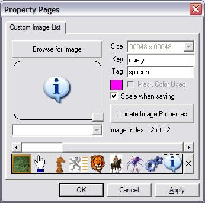



## LaVolpe ImageList

### Description

Another project using my c32bppDIB classes. This is a custom image list that supports alpha images and has one neat property that haven't seen before. This custom image list control can be made part of your custom usercontrol so you don't have to ship 2 different controls. Two sample projects are included in zip, so unzip with "Use Folders" checked. Some highlights: supports alpha images, mulitple image sizes, allows scaling when adding to imagelists, and many more. I am planning on using this for multiple custom controls in the near future. Still have some things that I want this to do or be compatible with. I am not completely done with this project but offer it to you for your suggestions and comments.
 
### More Info
 

             |
---                |---
**Submitted On**   |2007-09-20 17:42:34
**By**             |[LaVolpe](https://github.com/Planet-Source-Code/PSCIndex/blob/master/ByAuthor/lavolpe.md)
**Level**          |Advanced
**User Rating**    |5.0 (80 globes from 16 users)
**Compatibility**  |VB 6\.0
**Category**       |[Custom Controls/ Forms/  Menus](https://github.com/Planet-Source-Code/PSCIndex/blob/master/ByCategory/custom-controls-forms-menus__1-4.md)
**World**          |[Visual Basic](https://github.com/Planet-Source-Code/PSCIndex/blob/master/ByWorld/visual-basic.md)
**Archive File**   |[LaVolpe\_Im2084129202007\.zip](https://github.com/Planet-Source-Code/lavolpe-lavolpe-imagelist__1-69368/archive/master.zip)

